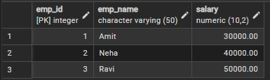
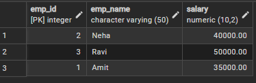
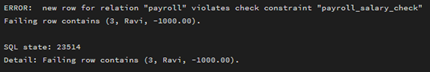
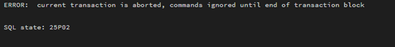
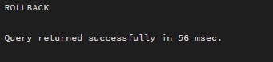
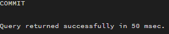

# Experiment 10: PostgreSQL Transactions

## 📌 Aim
To demonstrate transactions, savepoints, and rollback operations in PostgreSQL.

---

## 🛠 Tools Used
- PostgreSQL

---

## 📖 Theory
A transaction is a sequence of operations performed as a single logical unit of work. PostgreSQL supports transactions using BEGIN, COMMIT, and ROLLBACK. Savepoints allow partial rollback within a transaction.

---

## ⚙️ Implementation Steps

### Step 1: Create Table
```sql
CREATE TABLE Payroll (
    emp_id INT PRIMARY KEY,
    emp_name VARCHAR(50),
    salary DECIMAL(10,2) CHECK (salary > 0)
);
```

---

### Step 2: Insert Initial Data
```sql
INSERT INTO Payroll VALUES
(1, 'Amit', 30000),
(2, 'Neha', 40000),
(3, 'Ravi', 50000);
```

---

### Step 3: View Initial Data
```sql
SELECT * FROM Payroll;
```

📸 Output Image:


---

## 🔁 Transaction Block
```sql
BEGIN;
```

---

### Step 4: Update Salary (Valid)
```sql
UPDATE Payroll
SET salary = salary + 5000
WHERE emp_id = 1;
```

---

### Step 5: Savepoint
```sql
SAVEPOINT sp1;
```

📸 Output Image:


---

### Step 6: Another Valid Update
```sql
UPDATE Payroll
SET salary = salary + 7000
WHERE emp_id = 2;
```

---

### Step 7: Error Simulation
```sql
UPDATE Payroll
SET salary = -1000
WHERE emp_id = 3;
```

📸 Output Image:


---

### Step 8: Rollback
```sql
ROLLBACK TO sp1;
```

📸 Output Image:


---

### Step 9: Commit
```sql
COMMIT;
```

📸 Output Image:


---

### Step 10: Final Data
```sql
SELECT * FROM Payroll;
```

📸 Output Image:


---

## 📈 Learning Outcomes
- Understood transaction management in PostgreSQL
- Learned how to use savepoints
- Implemented rollback for error handling

---

## 👨‍🎓 Author
Sahil Hans  
MCA (AI & ML)  
Chandigarh University
