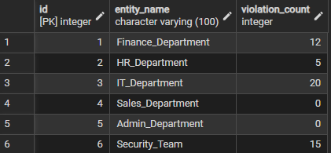
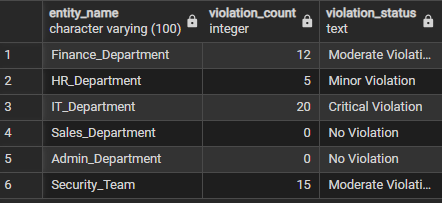
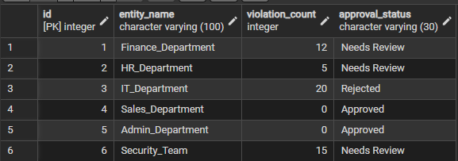
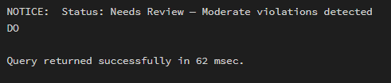
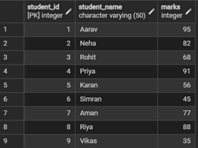
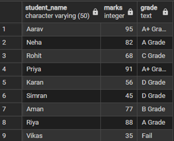
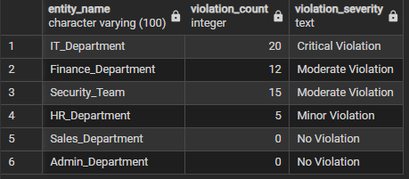

# Experiment 03 – Conditional Logic Using CASE and IF–ELSE

## Student Information
- Name: Sahil Hans  
- UID: 25MCI10088  
- Branch: MCA (AI & ML)  
- Section: MAM-1 A  
- Semester: Second Semester  
- Subject: Technical Skills  
- Date of Performance: 12/01/2026  

---

## Aim
To implement conditional decision-making logic in PostgreSQL using CASE expressions and IF–ELSE constructs for classification, validation, and rule-based data processing.

---

## Software Requirements
- PostgreSQL  
- pgAdmin  
- Oracle Database Express Edition (optional)

---

## Objectives
- Understand conditional execution in SQL  
- Implement decision-making logic using CASE expressions  
- Simulate real-world rule validation scenarios  
- Classify data based on multiple conditions  
- Strengthen SQL logic skills required in interviews and backend systems  

---

## Step 1: Database and Table Preparation

```sql
CREATE TABLE Violations (
    id INT PRIMARY KEY,
    entity_name VARCHAR(100),
    violation_count INT
);
```

```sql
INSERT INTO Violations VALUES
(1, 'Finance_Department', 12),
(2, 'HR_Department', 5),
(3, 'IT_Department', 20),
(4, 'Sales_Department', 0),
(5, 'Admin_Department', 0),
(6, 'Security_Team', 15);
```

### Output


---

## Step 2: CASE Classification

```sql
SELECT entity_name, violation_count,
CASE
    WHEN violation_count = 0 THEN 'No Violation'
    WHEN violation_count BETWEEN 1 AND 5 THEN 'Minor Violation'
    WHEN violation_count BETWEEN 6 AND 15 THEN 'Moderate Violation'
    ELSE 'Critical Violation'
END AS Violation_Status
FROM Violations;
```

### Output


---

## Step 3: CASE Updates

```sql
ALTER TABLE Violations
ADD COLUMN approval_status VARCHAR(30);
```

```sql
UPDATE Violations
SET approval_status =
CASE
    WHEN violation_count = 0 THEN 'Approved'
    WHEN violation_count BETWEEN 1 AND 15 THEN 'Needs Review'
    ELSE 'Rejected'
END;
```

### Output


---

## Step 4: IF–ELSE Using PL/pgSQL

```sql
DO $$
DECLARE
    v_violation_count INT := 12;
BEGIN
    IF v_violation_count = 0 THEN
        RAISE NOTICE 'Approved';
    ELSIF v_violation_count BETWEEN 1 AND 5 THEN
        RAISE NOTICE 'Minor Violation';
    ELSIF v_violation_count BETWEEN 6 AND 15 THEN
        RAISE NOTICE 'Moderate Violation';
    ELSE
        RAISE NOTICE 'Critical Violation';
    END IF;
END $$;
```

### Output


---

## Step 5: Grading System

```sql
CREATE TABLE StudentGrades (
    student_id SERIAL PRIMARY KEY,
    student_name VARCHAR(50),
    marks INT
);
```

```sql
INSERT INTO StudentGrades VALUES
(DEFAULT,'Aarav',95),
(DEFAULT,'Neha',82),
(DEFAULT,'Rohit',68),
(DEFAULT,'Priya',91),
(DEFAULT,'Karan',56),
(DEFAULT,'Simran',45),
(DEFAULT,'Aman',77),
(DEFAULT,'Riya',88),
(DEFAULT,'Vikas',35);
```
### Output

```sql
SELECT student_name, marks,
CASE
    WHEN marks >= 90 THEN 'A+ Grade'
    WHEN marks BETWEEN 80 AND 89 THEN 'A Grade'
    WHEN marks BETWEEN 70 AND 79 THEN 'B Grade'
    WHEN marks BETWEEN 60 AND 69 THEN 'C Grade'
    WHEN marks BETWEEN 40 AND 59 THEN 'D Grade'
    ELSE 'Fail'
END AS Grade
FROM StudentGrades;
```

### Output


---

## Step 6: CASE for Custom Sorting

```sql
SELECT entity_name, violation_count,
CASE
    WHEN violation_count > 15 THEN 'Critical Violation'
    WHEN violation_count BETWEEN 6 AND 15 THEN 'Moderate Violation'
    WHEN violation_count BETWEEN 1 AND 5 THEN 'Minor Violation'
    ELSE 'No Violation'
END AS Severity
FROM Violations
ORDER BY
CASE
    WHEN violation_count > 15 THEN 1
    WHEN violation_count BETWEEN 6 AND 15 THEN 2
    WHEN violation_count BETWEEN 1 AND 5 THEN 3
    ELSE 4
END;
```

### Output


---

## Learning Outcomes
- Implemented CASE expressions for classification  
- Used IF–ELSE procedural logic  
- Applied conditional updates  
- Performed rule-based sorting  
- Improved backend SQL decision logic  

---

## Conclusion
This worksheet demonstrated practical implementation of conditional logic in PostgreSQL using CASE and IF–ELSE constructs for real-world scenarios.
