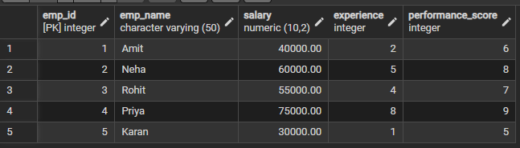
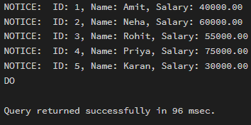
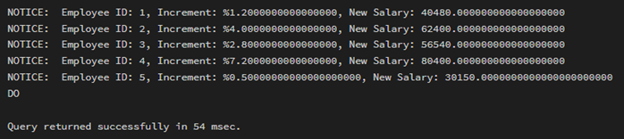
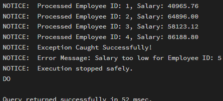

# WORKSHEET 5 – Cursor Implementation in PostgreSQL

## Student Information
- Name: Sahil Hans  
- UID: 25MCI10088  
- Branch: MCA (AI & ML)  
- Section: MAM-1 A  
- Semester: Second Semester  
- Subject: Technical Skills  
- Date of Performance: 12/01/2026  

---

## AIM
To gain hands-on experience in creating and using cursors for row-by-row processing in a database, enabling sequential access and manipulation of query results for complex business logic.  
(Company Tags: Infosys, Wipro, TCS, Capgemini)

---

## Software Requirement
- Oracle Database Express Edition  
- PostgreSQL  
- pgAdmin  

---

## OBJECTIVES
- Sequential Data Access using cursors  
- Row-Level Manipulation with procedural logic  
- Cursor Lifecycle Management (Declare, Open, Fetch, Close)  
- Exception Handling during large-scale iteration  

---

# Practical / Experiment Steps

---

## Step 0: Setup (Table Creation)

```sql
CREATE TABLE Employee (
    emp_id SERIAL PRIMARY KEY,
    emp_name VARCHAR(50),
    salary NUMERIC(10,2),
    experience INT,
    performance_score INT
);
```

### Insert Sample Values

```sql
INSERT INTO Employee (emp_name, salary, experience, performance_score) VALUES
('Amit', 40000, 2, 6),
('Neha', 60000, 5, 8),
('Rohit', 55000, 4, 7),
('Priya', 75000, 8, 9),
('Karan', 30000, 1, 5);
```

### Output


---

## Step 1: Simple Forward-Only Cursor

```sql
DO $$
DECLARE
    emp_record RECORD;
    emp_cursor CURSOR FOR
        SELECT emp_id, emp_name, salary FROM Employee;
BEGIN
    OPEN emp_cursor;
    LOOP
        FETCH emp_cursor INTO emp_record;
        EXIT WHEN NOT FOUND;
        RAISE NOTICE 'ID: %, Name: %, Salary: %',
                     emp_record.emp_id,
                     emp_record.emp_name,
                     emp_record.salary;
    END LOOP;
    CLOSE emp_cursor;
END $$;
```

### Output


---

## Step 2: Complex Row-by-Row Manipulation

```sql
DO $$
DECLARE
    emp_record RECORD;
    emp_cursor CURSOR FOR
        SELECT emp_id, salary, experience, performance_score FROM Employee;
    increment_percent NUMERIC;
    new_salary NUMERIC;
BEGIN
    OPEN emp_cursor;
    LOOP
        FETCH emp_cursor INTO emp_record;
        EXIT WHEN NOT FOUND;

        increment_percent :=
            (emp_record.experience * emp_record.performance_score) / 10.0;

        new_salary :=
            emp_record.salary +
            (emp_record.salary * increment_percent / 100);

        UPDATE Employee
        SET salary = new_salary
        WHERE emp_id = emp_record.emp_id;

        RAISE NOTICE
        'Employee ID: %, Increment: %%%, New Salary: %',
        emp_record.emp_id,
        increment_percent,
        new_salary;

    END LOOP;
    CLOSE emp_cursor;
END $$;
```

### Output


---

## Step 3: Exception and Status Handling

```sql
DO $$
DECLARE
    emp_record RECORD;
    emp_cursor CURSOR FOR
        SELECT emp_id, salary FROM Employee;
BEGIN
    OPEN emp_cursor;

    LOOP
        FETCH emp_cursor INTO emp_record;
        EXIT WHEN NOT FOUND;

        IF emp_record.salary < 35000 THEN
            RAISE EXCEPTION
            'Salary too low for Employee ID: %',
            emp_record.emp_id;
        END IF;

        RAISE NOTICE
        'Processed Employee ID: %, Salary: %',
        emp_record.emp_id,
        emp_record.salary;

    END LOOP;

    CLOSE emp_cursor;

EXCEPTION
    WHEN OTHERS THEN
        RAISE NOTICE 'Exception Caught Successfully!';
        RAISE NOTICE 'Error Message: %', SQLERRM;
        RAISE NOTICE 'Execution stopped safely.';
END $$;
```

### Output


---

# Outcomes
- Students will be able to implement and manage cursors for row-wise processing.
- Demonstrate lifecycle management of cursors.
- Handle exceptions effectively during iteration.
- Apply cursor logic to real-world payroll and enterprise scenarios.

---

## Conclusion
This experiment demonstrated practical implementation of cursors in PostgreSQL for sequential row processing, dynamic data manipulation, and structured exception handling in enterprise-level database systems.
