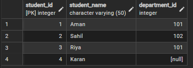
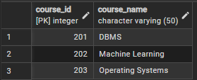
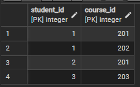
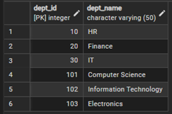
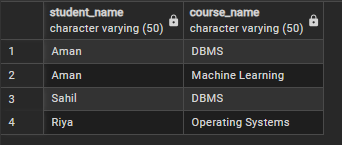
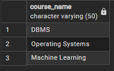
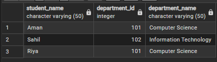
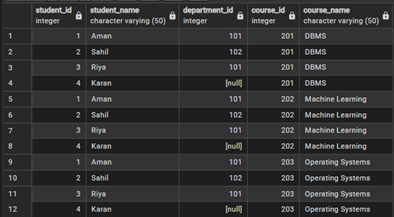

# 📘 Experiment 7: Implementation of JOINS in PostgreSQL

## 👤 Student Details
- **Name:** Sahil Hans  
- **UID:** 25MCI10088  
- **Branch:** MCA (AI & ML)  
- **Semester:** 2nd  
- **Subject:** Technical Skills  

---

## 🎯 Aim
To implement different types of SQL JOIN operations in PostgreSQL.

---

## 🧰 Software Requirements
- PostgreSQL / pgAdmin  
- Oracle Database Express Edition (optional)

---

## 📌 Objectives
1. To understand how relational tables are connected using different types of SQL joins.  
2. To implement INNER, LEFT, RIGHT, and CROSS JOIN operations.  
3. To analyze relationships between students, courses, and departments.  
4. To identify unmatched records using LEFT and RIGHT JOIN.  
5. To explore many-to-many relationships using a bridge table.  
6. To generate meaningful insights from multiple tables.  

---

## 🗂️ Database Setup

### Tables Created
- Studentss  

- Courses  

- Enrollments  

- Departments  

---

## ⚙️ Experiment Steps

### 🔹 Step 1: INNER JOIN  
List students with their enrolled courses.

📸 Output Screenshot:  

---

### 🔹 Step 2: LEFT JOIN  
Find students not enrolled in any course.

📸 Output Screenshot:  

---

### 🔹 Step 3: RIGHT JOIN  
Display all courses with or without enrolled students.

📸 Output Screenshot:  

---

### 🔹 Step 4: MULTIPLE JOIN  
Show students with department information.

📸 Output Screenshot:  

---

### 🔹 Step 5: CROSS JOIN  
Display all possible student-course combinations.

📸 Output Screenshot:  

---

## 📊 Outcomes
1. Learned to write SQL queries using different JOIN types.  
2. Understood how to work with relational data across multiple tables.  
3. Identified relationships like one-to-many and many-to-many.  
4. Retrieved both matching and non-matching records using JOINs.  
5. Improved database querying and problem-solving skills.  

---

## ✅ Conclusion
This experiment helped in understanding how SQL JOINs work in real-world relational databases and how multiple tables can be combined to extract meaningful information.

---

