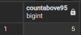
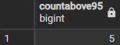
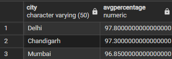

# Experiment 01.2 – CASE Statement and Aggregate Functions

## Student Information
- Name: Sahil Hans  
- UID: 25MCI10088  
- Branch: MCA (AI & ML)  
- Section: MAM-1 A  
- Semester: Second Semester  
- Subject: Technical Skills  
- Date of Performance: 12/01/2026  

---

## Aim
To design and implement SQL queries on a Students table using CASE statements and aggregate functions to perform conditional and statistical analysis.

---

## Software Requirements
- PostgreSQL  
- pgAdmin  
- Oracle Database Express Edition (optional)

---

## Objectives
- Understand relational table structure  
- Create tables using primary keys  
- Apply conditional filtering  
- Use CASE statements  
- Perform aggregation using COUNT and AVG  
- Group and sort results city-wise  

---

## Step 1: Table Creation

```sql
CREATE TABLE Students (
    StudentID INT PRIMARY KEY,
    StudentName VARCHAR(50),
    City VARCHAR(50),
    Percentage DECIMAL(5,2)
);
```

---

## Step 2: Insert Sample Data

```sql
INSERT INTO Students (StudentID, StudentName, City, Percentage) VALUES
(1, 'Aarav',   'Delhi',     96.5),
(2, 'Neha',    'Mumbai',    89.2),
(3, 'Rohit',   'Delhi',     91.0),
(4, 'Priya',   'Chandigarh',97.3),
(5, 'Karan',   'Mumbai',    95.8),
(6, 'Simran',  'Chandigarh',88.4),
(7, 'Aman',    'Delhi',     99.1),
(8, 'Riya',    'Mumbai',    92.6),
(9, 'Sahil',   'Chandigarh',85.9),
(10,'Ananya',  'Delhi',     94.7),
(11,'Vikas',   'Mumbai',    97.9),
(12,'Pooja',   'Chandigarh',90.5);
```

### Output


---

## Question (i): Count of students with percentage > 95

### Using CASE

```sql
SELECT COUNT(CASE WHEN Percentage > 95 THEN 1 END) AS CountAbove95
FROM Students;
```

### Output


---

### Without CASE

```sql
SELECT COUNT(*) AS CountAbove95
FROM Students
WHERE Percentage > 95;
```

### Output


---

## Question (ii): Average percentage city-wise (>95)

```sql
SELECT City,
       AVG(CASE WHEN Percentage > 95 THEN Percentage END) AS AvgPercentage
FROM Students
GROUP BY City
ORDER BY AvgPercentage DESC;
```

### Output


---

## Learning Outcomes
- Understanding relational table structures  
- Table creation using CREATE TABLE  
- Data filtering using WHERE clause  
- Conditional logic using CASE  
- Aggregation using COUNT and AVG  
- Grouping and sorting using GROUP BY and ORDER BY  

---

## Conclusion
This experiment strengthened understanding of SQL CASE statements and aggregate functions, enabling efficient data analysis and reporting.
